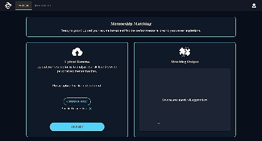
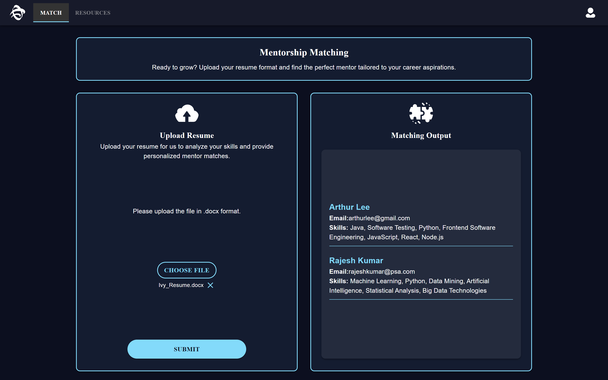
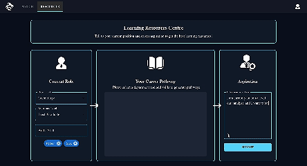
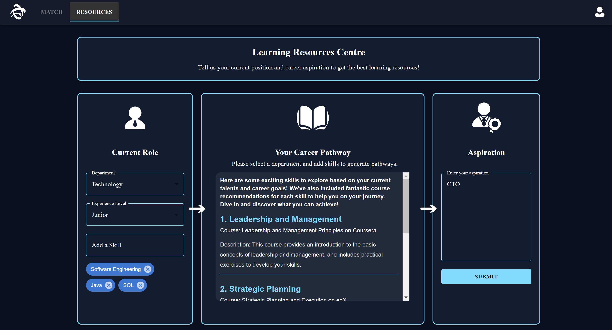

# *Mentora* by PSA Code Sprint 2024 Team 126 LTYZ
## Introduction
### Tech Stack


Mentora is an advanced Mentorship Matchmaking App designed to reinforce PSA's commitment to fostering a diverse and engaged workforce. 

Utilizing cutting-edge data and AI-driven solutions, the app intelligently pairs employees with possible mentors within the institution based on their backgrounds and skill sets, thereby fostering a collaborative environment where knowledge sharing and supporting employees across all generations in their professional development.

To cultivate a culture of continuous learning and belonging, Mentora utilises AI power to suggest tailored career pathways and learning resources based on employees' current skill sets and future career aspirations, effectively empowering employees to identify growth opportunities aligned with their individual goals in a dynamic environment and drive long-term success within the dynamic port ecosystem.

## Problem Theme
Future-Ready Workforce

In today’s fast-changing business environment, PSA is committed to building an empowered and diverse workforce, capable of thriving amid constant transformation.

#### Key focus areas
Multi-generational Workforce Engagement
Data-driven Career Pathway
Technology-driven Initiatives that enhance well-being and promote equity and inclusion. 
 
The goal is to enhance PSA's capacity to cultivate a highly engaged and diverse workforce by developing innovative, data and AI-driven solutions that promote continuous learning and belonging, supporting employees of all generations and driving long-term success in the dynamic port ecosystem.

## Getting Started with Our Web App
We deployed our web app prototype with Netlify. \
Here is the link to Mentora. You can start exploring our app now!\
[Link to the Mentora](https://symphonious-cascaron-96b516.netlify.app/)
## User Guide

### Landing Page
On the landing page, click on the "Sign Up" button to create an account.

.png)

### Login Page
If you already have an account, simply click on the "Log In" button to access your dashboard.

.png)

### Mentorship Matching
Our platform empowers users to **cultivate a culture of continuous learning and belonging** by enabling them to upload their DOCX resumes. The system will analyze your resume and match you with mentors in the database who share similar skillsets, making it easier to **identify growth opportunities** and **foster meaningful professional relationships**.

The **match-making process is powered by AI**, ensuring that you are paired with mentors who can guide you on the most relevant learning paths.

#### Matching Page Gif
We have added animation effect to improve the user interface and add fun to the user experience. Let's see it in action!\

#### Matching Page Screen


### Career Pathway Generator

The **Career Pathway Generator** is designed to help you take the next step in your career. You can input your current role and the role you aspire to, and the system will generate a list of **skills** you need to develop and recommend **learning resources**.

This feature is **AI-powered**, meaning it analyzes your input and provides highly accurate suggestions. The system is designed to be **acute** and **efficient**, ensuring that you receive the most relevant pathways and opportunities to upskill.

By using this tool, you can **identify growth opportunities** in your career and take actionable steps toward achieving your goals.

#### Career Pathway Generator Gif
Again, we added animated typing effect to improve the user experience!



#### Career Pathway Generator Screen


### Why Choose This Platform?
- **AI-powered Learning:** Our platform leverages **AI** to offer precise recommendations and mentorship connections based on your skills and goals.
- **Continuous Learning Culture:** We aim to **cultivate a culture of continuous learning and belonging** by connecting professionals with mentors and providing personalized career pathways.
- **Identify Growth Opportunities:** Whether you're looking to enhance your current role or move into a new position, our system helps you **identify growth opportunities** by offering skill-building recommendations and learning resources tailored to your aspirations.

### Get Started Today
Join us and take charge of your career development. With our **AI-powered** platform, you can **cultivate a culture of continuous learning** in your organization while taking action to **identify growth opportunities** and advance your career.


# Instructions for Building Locally
Remember to create a `.env` file to include you own firebase configuration and OPENAI keys to enable the database and AI api connection! \
The deployed app has access to our team's own firebase database and OPENAI api, but you need your own api keys to access to the full functionalities in the local environment.
```
REACT_APP_FIREBASE_API_KEY="YOU_KEY"
REACT_APP_FIREBASE_AUTH_DOMAIN="YOUR_DOMAIN"
REACT_APP_FIREBASE_PROJECT_ID="YOU_PROJECT_ID"
REACT_APP_FIREBASE_STORAGE_BUCKET="YOUR_STORAGE_BUCKET"
REACT_APP_FIREBASE_MESSAGING_SENDER_ID="YOUR_SENDER_ID"
REACT_APP_FIREBASE_APP_ID="YOUR_APP_ID"
REACT_APP_FIREBASE_MEASUREMENT_ID="YOUR_MEASUREMENT_ID"
REACT_APP_OPENAI_API_KEY="YOUR_OPENAI_API_KEY"
```
After you download the repository, you can install the relevant dependencies and run:
### `npm start`
Runs the app in the development mode.\
Open [http://localhost:3000](http://localhost:3000) to view it in your browser.
The page will reload when you make changes.\
You may also see any lint errors in the console.
### `npm test`
Launches the test runner in the interactive watch mode.\
See the section about [running tests](https://facebook.github.io/create-react-app/docs/running-tests) for more information.
### `npm run build`
Builds the app for production to the `build` folder.\
It correctly bundles React in production mode and optimizes the build for the best performance.
The build is minified and the filenames include the hashes.\
Your app is ready to be deployed!
See the section about [deployment](https://facebook.github.io/create-react-app/docs/deployment) for more information.

